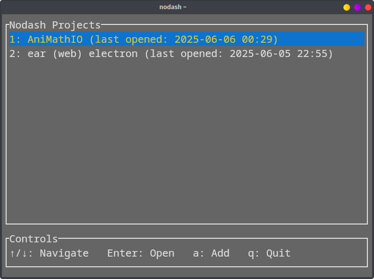

# nodash



`nodash` is a modern terminal-based project launcher and manager for nvm node projects — fast, minimal, and built with Rust.

Easily manage and open your most-used dev projects with a slick TUI interface.

---

## ✨ Features

- ⚡ Launch projects with a single keypress
- 🗂 Store and manage your favorites
- 🎨 Beautiful TUI (powered by Ratatui)
- 📦 Self-updating via GitHub releases
- 🧩 Minimal dependencies, fast and portable

---

## 📥 Installation (GNU/Linux only)

To install the latest version:

```bash
curl -sSL https://raw.githubusercontent.com/MemerGamer/nodash/main/install.sh | bash
```

> Requires `curl` and `sudo` to move the binary to `/usr/local/bin`.

---

## 🚀 Usage

```bash
nodash
```

Interactive TUI will open.

### 🛠 Commands

```bash
nodash update
```

Check for updates and self-update the binary.

---

## 🔧 Building from Source

To build a release binary manually:

```bash
cargo build --release
```

This will generate the binary at:

```bash
target/release/nodash
```

You can move it to a directory in your `PATH`:

```bash
cp target/release/nodash /usr/local/bin/
```

---

## 🛡 License

MIT License © 2025 [MemerGamer](https://github.com/MemerGamer)

---

## 🙌 Contributing

PRs and feedback welcome! Feel free to [open an issue](https://github.com/MemerGamer/nodash/issues) or submit a pull request.
